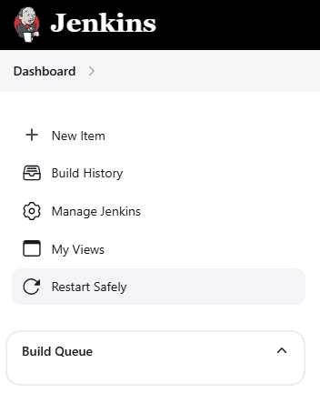

# Safe Restarter

This plugin allows you to restart Jenkins safely.
Jenkins restarts once all running jobs are finished.

Pipeline builds may prevent Jenkins from restarting for a short period of time in some cases, but if so, they will be paused at the next available opportunity and then resumed after Jenkins restarts.
["Scaling Pipelines"](https://www.jenkins.io/doc/book/pipeline/scaling-pipeline/) provides an overview of Pipeline durability options.

## Side panel

## Manage Jenkins page

